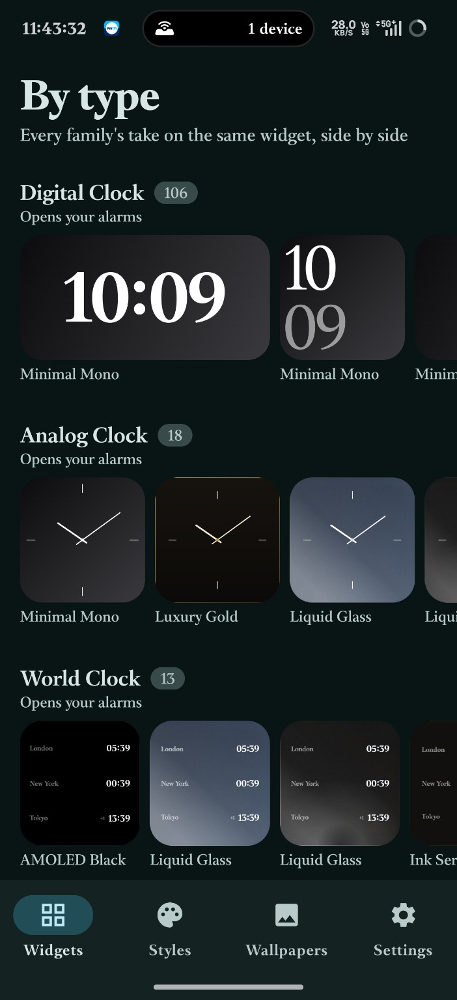
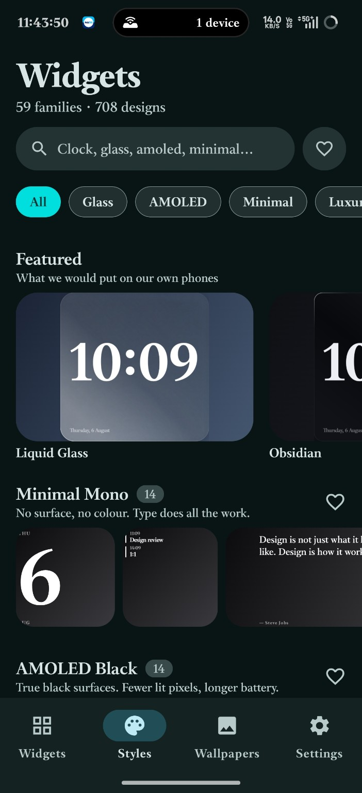
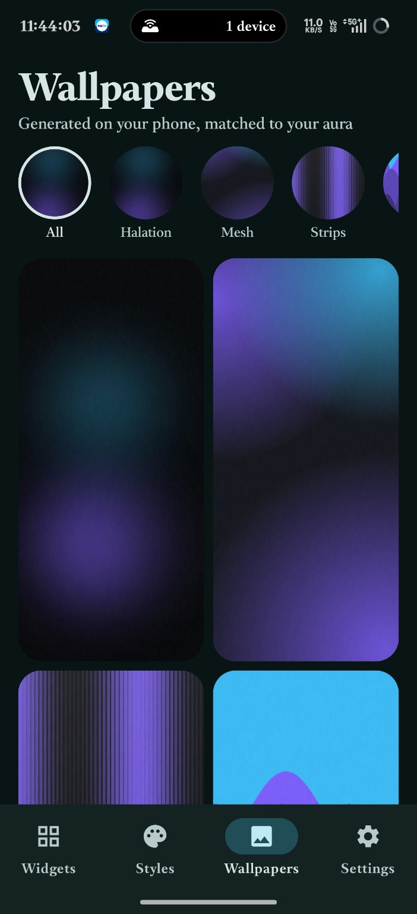
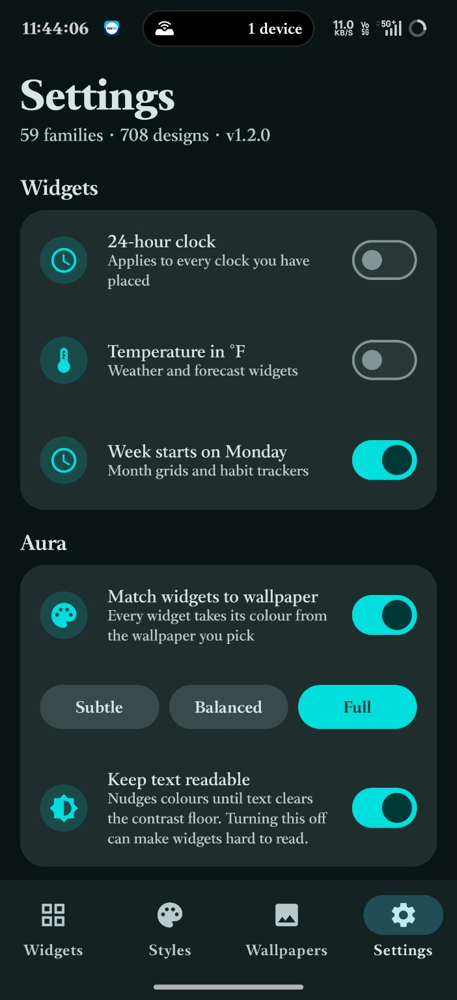

# Prism — Android Widget Platform

> A premium Android home-screen customization app focused on customizable, modern widget experiences.

**Status:** 🚧 Active Development

Prism is a Kotlin-based Android project for creating, previewing, and managing customizable home-screen widgets. The project uses a shared rendering pipeline so widget previews and rendered widgets stay consistent.

---

## ✨ Project Highlights

- 📱 Android home-screen widget system
- 🎨 Customizable widget configurations
- 🔎 Widget catalog and live editor
- 🧩 Shared rendering pipeline
- 🖼️ Multiple widget families and variants
- ✏️ Canvas-based rendering
- 📦 Bitmap-based widget output
- 🏗️ Modular Android architecture
- 🧪 Automated testing and validation
- 📚 Documentation-driven development

---

## 🧩 Widget System

A widget is represented as data rather than as a fixed layout.

A `WidgetSpec` containing the widget family, variant, and user configuration is resolved into a `WidgetStyle`.

The rendering pipeline then converts the style into a bitmap that can be displayed through Android's widget system.

The same rendering path is used for previews and widget output, helping keep the editor preview consistent with the actual widget.

### Current Project Scale

- **32 widget families**
- **~13 variants per family**
- **~416 widget configurations**
- **~19 content renderers**
- **11 layouts**

---

## 🏗️ Architecture

The project follows a modular structure:

<pre>
app/
├── Main application module
│
├── core/
│   └── Shared application and rendering logic
│
├── feature/
│   └── Feature-specific functionality
│
├── widget/
│   └── Widget system and widget rendering
│
├── branding/
│   └── Application branding resources
│
└── docs/
    └── Architecture and development documentation
</pre>

---

## 📱 App Preview

A look at Prism's widget catalog, visual styles, wallpaper system, and settings.

### Widgets

### Styles

### Wallpapers

### Settings

---

## 🎨 Design Philosophy

Prism is built around the idea that widgets should behave as **visual systems**, rather than being collections of fixed layouts.

The same underlying widget specification can be rendered through different styles, layouts, and visual treatments while maintaining a consistent data model.

This allows Prism to support:

- Different visual styles
- Multiple widget variants
- Wallpaper-aware appearance
- User customization
- Shared rendering logic
- Consistent editor previews
- Consistent widget output

---

## 🖼️ Rendering Pipeline

The core rendering flow is:

**Widget Specification → Widget Style → Canvas Rendering → Bitmap → Android Widget**

This architecture allows the application to use the same rendering logic for both the live editor and the actual home-screen widget.

That reduces the gap between:

**What you configure → What you preview → What you place on the home screen**

---

## 📚 Documentation

Project documentation is maintained inside the `docs/` directory.

Important documents include:

- [`ARCHITECTURE.md`](docs/ARCHITECTURE.md)
- [`ROADMAP.md`](docs/ROADMAP.md)
- [`BUILD.md`](docs/BUILD.md)
- [`AUDIT_1.2.0.md`](docs/AUDIT_1.2.0.md)
- [`COMPETITIVE_CROSSCHECK.md`](docs/COMPETITIVE_CROSSCHECK.md)
- [`DESIGN_SYSTEM.md`](docs/DESIGN_SYSTEM.md)
- [`DEFECT_LOG.md`](docs/DEFECT_LOG.md)
- [`PERFORMANCE_REPORT.md`](docs/PERFORMANCE_REPORT.md)
- [`FUTURE.md`](docs/FUTURE.md)
- [`MOTION.md`](docs/MOTION.md)

---

## 🛠️ Technology

Prism is built primarily with:

- **Kotlin**
- **Android**
- **Gradle**
- **Canvas rendering**
- **Android RemoteViews**
- **Bitmap-based widget rendering**
- **Modular project architecture**

---

## 🚧 Development Status

Prism is currently under active development.

The repository contains the application source, widget rendering system, feature modules, branding resources, development tooling, documentation, and testing infrastructure.

Features and project scale may continue to evolve during development.

---

## 📸 Screenshots

All application screenshots are available in:

[`docs/Screenshots/`](docs/Screenshots/)

Current screenshots include:

- Widget catalog
- Styles
- Wallpapers
- Settings

---

## 📄 License

License information will be added as the project approaches release.

---

## Prism

**Customizable widgets. One visual system.**
